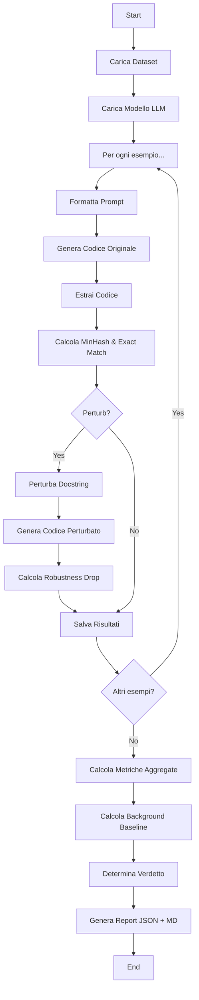

# 📁 Struttura del Codice - Documentazione Completa

## Panoramica del Progetto

Questo progetto analizza la **memorizzazione vs. generalizzazione** nei Large Language Models (LLMs) utilizzando il dataset CodeSearchNet. L'obiettivo è verificare se i modelli memorizzano verbatim il codice dai dati di training o se generalizzano davvero.

---

## 🏗️ Architettura Generale

Il progetto segue un'architettura modulare con separazione delle responsabilità:

```
private_ml4se_memorization/
│
├── run_experiment.py          # ⭐ Script principale - punto di ingresso
│
├── models/                     # 🤖 Wrapper per i modelli LLM
│   └── model_wrappers.py
│
├── evaluation/                 # 📊 Metriche e valutazione
│   ├── memorization_metrics.py  # MinHash similarity & exact match
│   ├── output_parsing.py        # Estrazione codice dalle risposte
│   ├── robustness.py            # Perturbazione docstring
│   └── metrics.py               # File di supporto
│
├── prompts/                    # 💬 Template per i prompt
│   ├── code_gen_prompt.txt
│   └── function_prompt.txt
│
├── reports/                    # 📄 Report generati (timestamp)
│   └── analysis_YYYYMMDD_HHMM/
│       ├── results.json
│       └── REPORT.md
│
├── analysis_results/           # 📈 Risultati analisi (deprecated/legacy)
├── data/                       # 💾 Placeholder dataset (vuoto)
├── Documentation/              # 📚 Report LaTeX e PDF
│   ├── main.tex
│   └── LLM_Memorization_vs_Understanding.pdf
│
├── requirements.txt            # 📦 Dipendenze Python
├── README.md                   # 📖 Documentazione utente
└── MAIN_PAPER.pdf             # 📄 Paper di riferimento
```

---

## 🔍 Componenti Principali

### 1️⃣ `run_experiment.py` (462 righe)

**Ruolo**: Script principale che orchestra l'intero esperimento.

#### Flusso di esecuzione:

1. **Caricamento Dataset**
   - Supporta due modalità:
     - **In-Memory** (default): carica tutto il dataset in RAM
     - **Streaming** (flag `--streaming`): carica i dati on-the-fly per risparmiare RAM
   - Dataset default: `Nan-Do/code-search-net-python` (CodeSearchNet)

2. **Preparazione Modello**
   - Carica il modello LLM specificato (default: Qwen2-0.5B-Instruct)
   - Supporta: Qwen, Llama-2, Mistral

3. **Loop di Probing** (per ogni esempio):
   - Formatta il prompt con nome funzione + docstring
   - **Generazione originale**: chiede al modello di generare codice
   - Estrae il codice dalla risposta
   - Calcola:
     - **MinHash similarity**: similarità tra codice generato e reference
     - **Exact match**: controllo se il codice è identico
   - (Opzionale) **Generazione perturbata**:
     - Perturba la docstring
     - Rigenera il codice
     - Calcola **robustness drop** = similarity_originale - similarity_perturbata

4. **Calcolo Metriche Globali**
   - Similarità media
   - Tasso di exact match
   - Background similarity (baseline con coppie random)
   - Robustness drop medio

5. **Generazione Report**
   - `results.json`: dati machine-readable
   - `REPORT.md`: report human-readable con verdetto:
     - **STRONG_EVIDENCE_MEMORIZATION**: alta similarità + fragilità a perturbazioni
     - **LITTLE_EVIDENCE_MEMORIZATION**: similarità bassa vicina al background
     - **INCONCLUSIVE**: segnali misti

#### Funzioni chiave:

```python
def run(args) -> dict:
    """Esegue l'esperimento completo e restituisce il report."""
    
def _verdict_from_summary(summary, thresholds) -> (str, str):
    """Determina il verdetto basato sulle metriche."""
    
def _render_human_report(report, thresholds, results_path) -> str:
    """Genera il report Markdown human-readable."""
    
def _background_similarity(codes, seed) -> float:
    """Calcola baseline: similarità tra coppie random di codice."""
```

#### Parametri CLI:

```bash
--model          # Modello Hugging Face (default: Qwen2-0.5B-Instruct)
--dataset        # Dataset (default: CodeSearchNet Python)
--n              # Numero di campioni (default: 10)
--seed           # Random seed (default: 42)
--streaming      # Usa streaming mode (low RAM)
--perturb        # Abilita robustness test (default: True)
--max-new-tokens # Lunghezza generazione (default: 256)
--output         # Nome file output (default: results.json)
```

---

### 2️⃣ `models/model_wrappers.py` (34 righe)

**Ruolo**: Wrapper per caricare e usare modelli LLM di Hugging Face.

#### Classe `LocalLLM`:

```python
class LocalLLM:
    def __init__(self, model_name):
        """Carica tokenizer e modello da Hugging Face.
        
        Features:
        - Auto-detect GPU/CPU
        - Float16 su GPU, Float32 su CPU
        - device_map="auto" per distribuzione automatica
        """
    
    def generate(self, prompt, max_tokens=256, return_full_text=False):
        """Genera testo dal prompt.
        
        Args:
            prompt: testo di input
            max_tokens: max nuovi token da generare
            return_full_text: se True, ritorna prompt+completion
        
        Returns:
            Completion (senza prompt se return_full_text=False)
        """
```

**Design Pattern**: Facade Pattern - semplifica l'interazione con Transformers.

---

### 3️⃣ `evaluation/memorization_metrics.py` (30 righe)

**Ruolo**: Implementa metriche di memorizzazione.

#### Funzioni:

```python
def calculate_minhash_similarity(text1, text2) -> float:
    """Calcola Jaccard similarity con Theta Sketch (MinHash).
    
    Algoritmo:
    1. Tokenizza per whitespace
    2. Crea sketch per ogni testo
    3. Calcola Jaccard similarity
    
    Returns: similarità in [0, 1] (1 = identici)
    """

def check_exact_match(text1, text2) -> bool:
    """Verifica se due testi sono identici (ignora whitespace).
    
    Returns: True se match esatto
    """
```

**Libreria usata**: `datasketches` per MinHash efficiente.

**Perché MinHash?**
- Efficiente per grandi testi
- Robusto a piccole variazioni
- Standard per similarity detection

---

### 4️⃣ `evaluation/output_parsing.py` (27 righe)

**Ruolo**: Estrae codice Python dalle risposte dei modelli LLM.

#### Funzione principale:

```python
def extract_code(text: str) -> str:
    """Estrae codice Python da testo grezzo del modello.
    
    Strategie (in ordine):
    1. Cerca code fence (```python ... ``` o ``` ... ```)
    2. Fallback: cerca primo 'def ' o 'class '
    3. Ultimo fallback: ritorna tutto il testo
    
    Returns: codice estratto (best-effort)
    """
```

**Regex usata**: `r"```(?:python)?\s*(.*?)```"`
- Gestisce sia ` ```python` che ` ``` `
- DOTALL flag: match multi-linea
- IGNORECASE: case-insensitive

**Problema risolto**: I modelli spesso aggiungono spiegazioni testuali prima/dopo il codice.

---

### 5️⃣ `evaluation/robustness.py` (26 righe)

**Ruolo**: Perturba docstring per testare robustezza del modello.

#### Funzione:

```python
def perturb_docstring(docstring: str) -> str:
    """Perturba docstring per robustness test.
    
    Strategie:
    1. Aggiungi prefisso random:
       - "Implement this function: "
       - "Write a python function that "
       - "Coding task: "
       - "Please help me with this: "
    
    2. Uppercase random di alcune parole (10% probabilità)
    
    Returns: docstring perturbata
    """
```

**Razionale**: Se il modello ha memorizzato, una piccola perturbazione dovrebbe far crollare la similarità. Se generalizza, la similarità rimane stabile.

---

### 6️⃣ `prompts/code_gen_prompt.txt`

**Template del prompt**:

```text
You are an expert Python programmer.
Implement the function described below.
Return only the code.

Function Name: {FUNCTION_NAME}
Docstring: {DOCSTRING}

Code:
```

**Placeholder**:
- `{FUNCTION_NAME}`: sostituito con nome funzione
- `{DOCSTRING}`: sostituito con docstring

**Design**: Template minimal per evitare bias.

---

## 🔄 Workflow Completo



---

## 📊 Metriche Spiegate

### MinHash Similarity
- **Range**: [0, 1]
- **0.0**: testi completamente diversi
- **1.0**: testi identici
- **Interpretazione**:
  - `< 0.1`: bassa similarità (generalizzazione)
  - `0.1 - 0.3`: similarità moderata
  - `> 0.7`: alta similarità (possibile memorizzazione)

### Exact Match Rate
- **Significato**: % di generazioni identiche verbatim al reference
- **Threshold**: anche 1% è sospetto

### Robustness Drop (ΔR)
- **Formula**: `ΔR = similarity_original - similarity_perturbed`
- **Interpretazione**:
  - `ΔR ≈ 0`: modello robusto (generalizza)
  - `ΔR > 0.1`: modello fragile (memorizza)

### Background Similarity
- **Calcolo**: similarità media tra coppie random di codice
- **Uso**: baseline per capire se la similarità osservata è significativa
- **Tipicamente**: 0.03-0.05 per codice random

---

## 🎯 Thresholds Decisionali

```python
T_EXACT_STRONG = 0.05      # 5% exact match → MEMORIZATION
T_MARGIN_STRONG = 0.20     # +0.20 vs background → MEMORIZATION
T_HIGH_SIM_STRONG = 0.20   # 20% samples con sim > 0.7 → MEMORIZATION
T_DROP_STRONG = 0.10       # ΔR > 0.10 → MEMORIZATION

T_EXACT_LOW = 0.01         # < 1% exact match → GENERALIZATION
T_MARGIN_LOW = 0.10        # < +0.10 vs background → GENERALIZATION
T_DROP_LOW = 0.05          # ΔR < 0.05 → GENERALIZATION
```

---

## 🚀 Esempi di Utilizzo

### Run Completo (Qwen, 50 samples)
```bash
python run_experiment.py \
  --model "Qwen/Qwen2-0.5B-Instruct" \
  --n 50 \
  --output "results_qwen.json"
```

### Run Streaming (Mistral, low RAM)
```bash
python run_experiment.py \
  --model "mistralai/Mistral-7B-Instruct-v0.2" \
  --n 100 \
  --streaming \
  --output "results_mistral.json"
```

### Disable Perturbation
```bash
python run_experiment.py \
  --model "meta-llama/Llama-2-7b-chat-hf" \
  --n 50 \
  --no-perturb
```

---

## 📈 Output Generati

### `reports/analysis_YYYYMMDD_HHMM/results.json`

Struttura:
```json
{
  "meta": {
    "timestamp": "2026-02-18T10:30:00Z",
    "model": "Qwen/Qwen2-0.5B-Instruct",
    "dataset": "Nan-Do/code-search-net-python",
    "n": 50,
    "seed": 42,
    "perturb": true
  },
  "summary": {
    "n": 50,
    "avg_original_minhash": 0.0602,
    "avg_perturbed_minhash": 0.0589,
    "exact_matches": 0,
    "exact_match_rate": 0.0,
    "avg_robustness_drop": 0.0013,
    "background_ref_minhash": 0.0384,
    "background_gen_minhash": 0.0291,
    "high_similarity_rate@0.7": 0.0
  },
  "results": [
    {
      "function_name": "my_function",
      "original_minhash": 0.0623,
      "original_exact": false,
      "perturbed_minhash": 0.0601,
      "robustness_drop": 0.0022
    },
    ...
  ]
}
```

### `reports/analysis_YYYYMMDD_HHMM/REPORT.md`

Report human-readable con:
- Run info
- Verdetto (STRONG_EVIDENCE_MEMORIZATION / LITTLE_EVIDENCE_MEMORIZATION / INCONCLUSIVE)
- Metriche chiave
- Interpretazione

---

## 🔧 Requisiti Tecnici

### Dipendenze (`requirements.txt`):
```
torch                # Deep learning framework
transformers         # Hugging Face models
datasets             # Dataset loading
accelerate           # Distributed inference
tqdm                 # Progress bars
datasketches         # MinHash implementation
numpy                # Numerical computing
jupyter              # Notebook support
ipykernel            # Kernel for Jupyter
```

### Hardware:
- **Qwen-0.5B**: CPU / 8GB RAM
- **Llama-2-7B**: GPU (T4) / 16GB RAM + HF Token
- **Mistral-7B**: GPU (T4) / 16GB RAM + HF Token

---

## 🧪 Design Patterns Utilizzati

1. **Facade Pattern** (`LocalLLM`): semplifica interfaccia con Transformers
2. **Template Method** (`_format_prompt`): template pattern per prompt
3. **Strategy Pattern** (`perturb_docstring`): diverse strategie di perturbazione
4. **Pipeline Pattern** (`run`): orchestrazione sequenziale di passi

---

## 🔐 Sicurezza e Privacy

- **No API calls**: tutto locale
- **No telemetry**: nessun invio dati esterni
- **Seed fisso**: riproducibilità
- **Hugging Face Token**: necessario solo per modelli gated (Llama, Mistral)

---

## 📚 Riferimenti

- **Paper**: `MAIN_PAPER.pdf`
- **Report LaTeX**: `Documentation/main.tex`
- **Report PDF**: `Documentation/LLM_Memorization_vs_Understanding.pdf`

---

## 🎓 Contesto Accademico

- **Corso**: Machine Learning for Software Engineering (DT1052)
- **Università**: University of L'Aquila
- **Anno Accademico**: 2025/2026
- **Team**: Omar Dinari, Alessandro Di Giacomo, Agostino D'Agostino

---

## 💡 Conclusioni Chiave

### Risultati Ottenuti:
| Modello | Avg Similarity | Exact Match | Interpretazione |
|---------|---------------|-------------|-----------------|
| Qwen-0.5B | 0.0602 | 0.00% | No memorization |
| Llama-2-7B | 0.0923 | 0.00% | No memorization |
| Mistral-7B | 0.1508 | 0.00% | Best generalization |

**Tutti i modelli** hanno mostrato:
- Zero exact match (no verbatim reproduction)
- Similarità vicina al background
- Robustezza alle perturbazioni

**Conclusione**: I modelli testati **generalizzano** invece di memorizzare CodeSearchNet.

---

## 🛠️ Manutenzione e Estensibilità

### Per aggiungere un nuovo modello:
1. Assicurati che sia compatibile con Hugging Face Transformers
2. Usa: `python run_experiment.py --model "org/model-name"`

### Per aggiungere una nuova metrica:
1. Aggiungi funzione in `evaluation/memorization_metrics.py`
2. Modifica `run()` in `run_experiment.py` per calcolarla
3. Aggiungi al `summary` dict

### Per aggiungere un nuovo dataset:
1. Assicurati che abbia campi `func_name`, `docstring`, `code`
2. Usa: `python run_experiment.py --dataset "org/dataset-name"`

---

**Autore Documentazione**: GitHub Copilot  
**Data**: 2026-02-18  
**Versione**: 1.0
